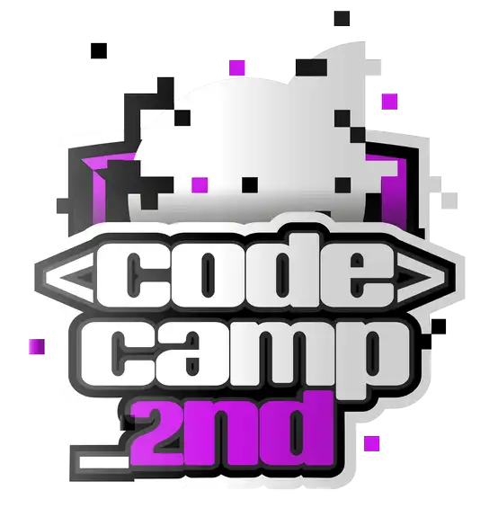

# Codecamp-2nd-Edition-Fortaleza-dos-CodeMiners
Detalhes do bootcamp
Vamos dar start em mais uma história?

A DIO está de volta trazendo a 2ª edição do Codecamp! Dessa vez contando sobre a Fortaleza dos CodeMiners.

Ao longe, avista-se a Grande Montanha, lar dos CodeMiners, uma comunidade habilidosa que escava em busca de recursos valiosos e informações ancestrais. Para ser aceito, é necessário provar sua utilidade no grupo, possuindo destreza com a picareta e habilidade na operação de máquinas pesadas, equipamentos fundamentais para a mineração de dados raros.

Atualmente, as máquinas pesadas utilizam técnicas pouco performáticas, e é aí que você pode fazer a diferença, utilizando suas habilidades na programação para ajudá-los a desvendar os segredos da Fortaleza dos CodeMiners.

Aproveite essa oportunidade e coloque em prática suas principais habilidades com lógica de programação, pensamento computacional e passe de fase ao completar os desafios de código utilizando C/C + +. Serão 11 desafios para você completar e ir em busca dos maiores prêmios.

Boa sorte na busca pela Fortaleza dos CodeMiners!

Atividades:
Mentorias (Live): Momento em que você irá se inspirar nos talentos das empresas mais inovadoras do mundo, podendo interagir ao longo da live e até fazer perguntas sobre carreira e tecnologia.

Desafio de Código: Coloque em prática todo o conhecimento adquirido nas aulas e teste o seu conhecimento na resolução de um desafio.

Desafio de Projeto: Construa o seu portfólio construindo projetos práticos com o conhecimento adquirido ao longo das aulas.

Ranking: Cada bootcamp possui um ranking com premiações exclusivas, onde você pontua de acordo com as interações que você realiza em Fórum e Rooms, dos acertos que você tem em questionários e da qualidade do código que você desenvolveu nos desafios.

Ferramentas para o seu aprendizado:
Fórum: Espaço para você interagir e tirar suas dúvidas técnicas com a nossa comunidade.

Rooms: Espaço para você conversar com outros matriculados no bootcamp e aumentar o seu networking.

Matriculados: Saiba quem está participando da mesma jornada educacional que você.

Certificado: Baixe e compartilhe os certificados de todas as suas conquistas ao longo desse bootcamp.
